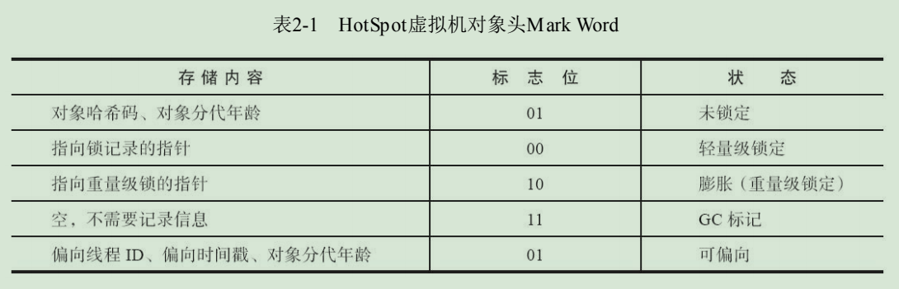

# 对象头分析

## 对象内存布局

在HotSpot虚拟机里，对象在堆内存中的存储布局可以划分为三个部分：

- 对象头（Header）
- 实例数据（Instance Data）
- 对齐填充（Padding）

对象头里包含如下信息：

- 1、用于存储对象自身的运行时数据，官方称它为“Mark Word”
  > 如哈希码（HashCode）、GC分代年龄、锁状态标志、线程持有的锁、偏向线程ID、偏向时间戳等，这部分数据的长度在32位和64位的虚拟机（未开启压缩指针）中分别为32个比特和64个比特。
- 2、类型指针
  > 即对象指向它的类型元数据的指针，Java虚拟机通过这个指针来确定该对象是哪个类的实例。并不是所有的虚拟机实现都必须在对象数据上保留类型指针，换句话说，查找对象的元数据信息并不一定要经过对象本身。
- 3、数组长度（仅在对象是一个Java数组时才有）
  > 如果对象是一个Java数组，那在对象头中还必须有一块用于记录数组长度的数据，因为虚拟机可以通过普通Java对象的元数据信息确定Java对象的大小，但是如果数组的长度是不确定的，将无法通过元数据中的信息推断出数组的大小。



1. 看了这个图，会不会有点小疑问，标志位有两个01，怎么区分无锁和可偏向呢？
   > 答：在未锁定和可偏向状态下，还有一位表示是否为偏向锁。

2. 对象年龄最大是多少呢？
   > 答：4bit，自然是15了

### Mark Word 32位虚拟机或64位虚拟机（开启了压缩指针 +UseCompressedOops）

```
|-------------------------------------------------------------|
|                   Mark Word (32 bits)                       |
|-------------------------------------------------------------|
|       23         |    2    |   4   |   是否为偏向锁 |锁标示位|
|-------------------------------------------------------------|
|     identity_hashcode:25   | age:4 | biased_lock:1 | lock:2 |  未锁定
|----------------------------------------------------|--------|
|     thread:23    | epoch:2 | age:4 | biased_lock:1 | lock:2 |  可偏向
|----------------------------------------------------|--------|
|    指向锁记录的指针  ptr_to_lock_record:30          | lock:2 |  轻量锁
|----------------------------------------------------|--------|
|    指向重量级锁的指针 ptr_to_heavyweight_monitor:30 | lock:2 |  重量锁
|----------------------------------------------------|--------|
|                                                    | lock:2 |  GC标记
|-------------------------------------------------------------|
```

### Mark Word 64位虚拟机（未开启压缩指针）

```
|-------------------------------------------------------------------------------|
|                              Mark Word (64 bits)                              |       
|-------------------------------------------------------------------------------|
|  unused:25 | identity_hashcode:31 | unused:1 | age:4 | biased_lock:1 | lock:2 |  无锁
|----------------------------------------------------------------------|--------|
|  thread:54 |         epoch:2      | unused:1 | age:4 | biased_lock:1 | lock:2 |  偏向锁
|----------------------------------------------------------------------|--------|
|                     ptr_to_lock_record:62                            | lock:2 |  轻量锁
|----------------------------------------------------------------------|--------|
|                     ptr_to_heavyweight_monitor:62                    | lock:2 |  重量锁
|----------------------------------------------------------------------|--------|
|                                                                      | lock:2 |   GC
|-------------------------------------------------------------------------------|
```

## 同步和对象锁定

Java编程语言的主要优势之一是其对多线程程序的内置支持。可以锁定在多个线程之间共享的对象，以便其同步访问。Java提供了用于指定关键代码区域的原语，
这些关键代码区域作用于共享对象，并且一次只能由一个线程执行。进入该区域的第一个线程将锁定共享对象。当第二个线程即将进入同一区域时，它必须等待，直到第一个线程再次将对象解锁。

在Java HotSpot™VM中，每个对象前面都有一个 `class pointer` 和一个 `header word`。
`header word`存储了 `identity hash code` 以及年龄和标记位，以便进行分代垃圾收集，还用于实现`thin lock`（轻量级锁的一种）。下图显示了`header word`的布局以及不同对象状态的表示。


图的右侧说明了标准锁定过程。只要对象被解锁，后两位的值就为01。当方法在对象上进行同步时，`header word`和指向该对象的指针将存储在当前堆栈帧内的锁定记录中。然后，VM尝试通过`compare-and-swap`
操作在对象的标题字中安装指向锁定记录的指针。如果成功，则当前线程将拥有该锁。由于锁定记录始终在字边界对齐，因此标头字的最后两位为00，然后将对象标识为已锁定。

如果`compare-and-swap`操作由于对象之前被锁定而失败，则VM首先测试`header word`是否指向当前线程的方法堆栈。在这种情况下，线程已经拥有对象的锁，可以安全地继续执行它。
对于这种递归锁定的对象，将锁定记录初始化为0，而不是对象的标题字。仅当两个不同的线程同时在同一对象上同步时，才必须将`thin lock`（轻量级锁的一种）膨胀为`heavyweight monitor`（重量级锁），以管理等待的线程。

轻量级锁比重量级锁便宜很多，但是它们的性能受到以下事实的困扰：尽管大多数对象只能由一个特定的线程锁定和解锁，但每个`compare-and-swap`操作都必须在多处理器计算机上以原子方式执行。在Java 6中，
此缺陷已通过所谓的“无存储偏向锁定”技术解决，该技术使用类似于的概念。只有第一个锁获取执行原子`compare-and-swap`，以将锁定线程的ID安装到标头字中，然后称该对象偏向于该线程。
同一线程将来对对象的锁定和解锁不需要任何原子操作或`header word`的更新。甚至堆栈上的锁定记录也不会被初始化，因为对于一个偏向的对象，它将永远不会被检查。

当一个线程在偏向另一个线程的对象上同步时，该偏向必须通过使该对象看起来像它已被常规方式锁定被撤销。遍历偏向所有者的堆栈，根据`thin lock`方案调整与对象关联的锁定记录，并在对象的`header word`
中安装指向它们中最旧的指针。此操作必须暂停所有线程。当访问对象的`identity hash code`时，由于此哈希码位与线程ID共享，因此该偏向也要被撤销。

明确设计为在多个线程之间共享的对象（例如生产者/消费者队列）不适合于偏向锁定。因此，如果某个类的实例在过去频繁发生吊销，则将禁用该类的偏向锁定。这称为批量撤销`bulk revocation`
。如果在禁用了偏向锁定的类的实例上调用锁定代码，则它将执行标准的轻量锁定`thin locking`。该类的新分配实例被标记为不可偏向的。

一种类似的机制，称为批量重偏向`bulk rebiasing`，可以优化类对象被不同线程锁定和解锁但绝不并行的情况。它使类的所有实例的偏向无效，而不会禁用偏向锁定。
该类中的epoch值用作指示偏向有效性的时间戳。在分配对象时，此值将复制到`header word`中。然后，批量重偏向可以被高效实现为在适当的类中增加epoch值。 下次要锁定此类的实例时，代码将在`header word`
中检测到一个不同的epoch值，并将该对象偏向当前线程。

## 参考文档

https://wiki.openjdk.java.net/display/HotSpot/Synchronization
