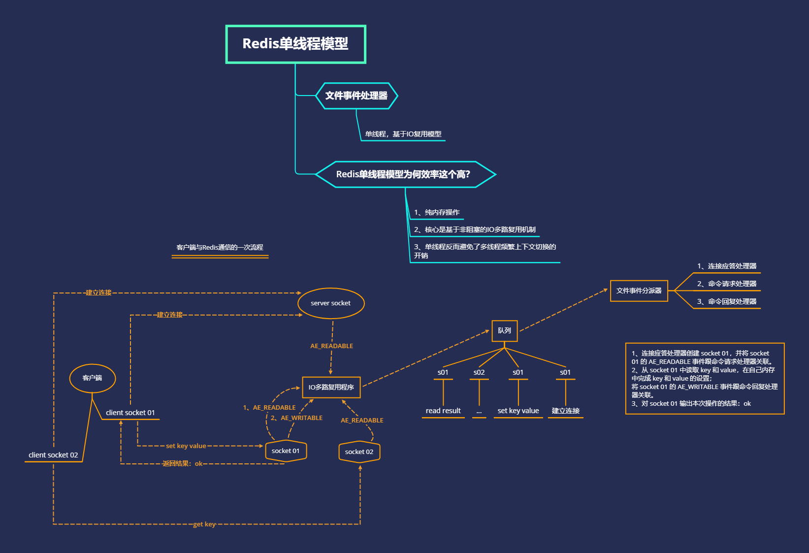
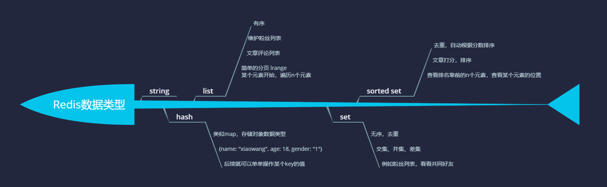
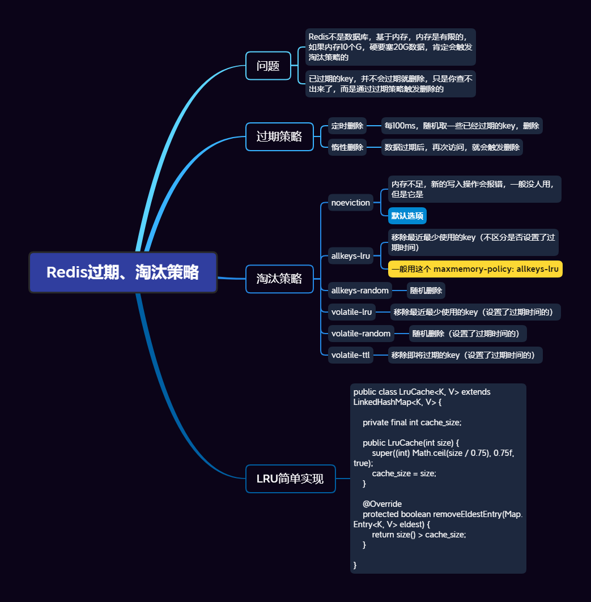
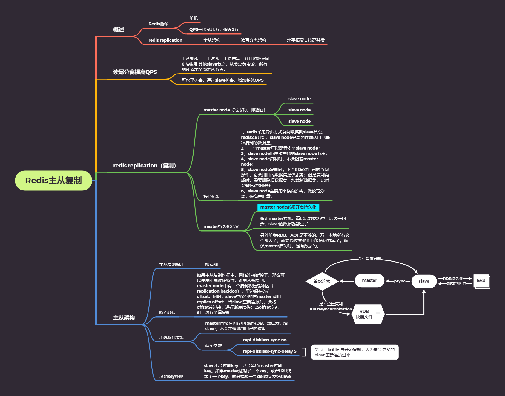
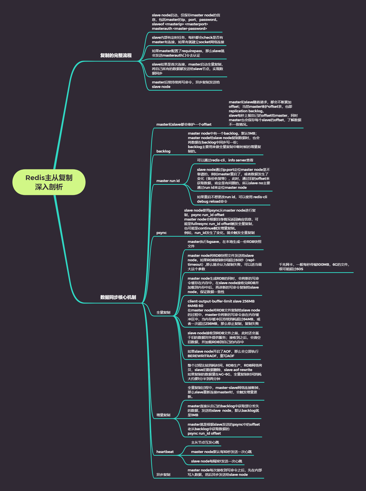
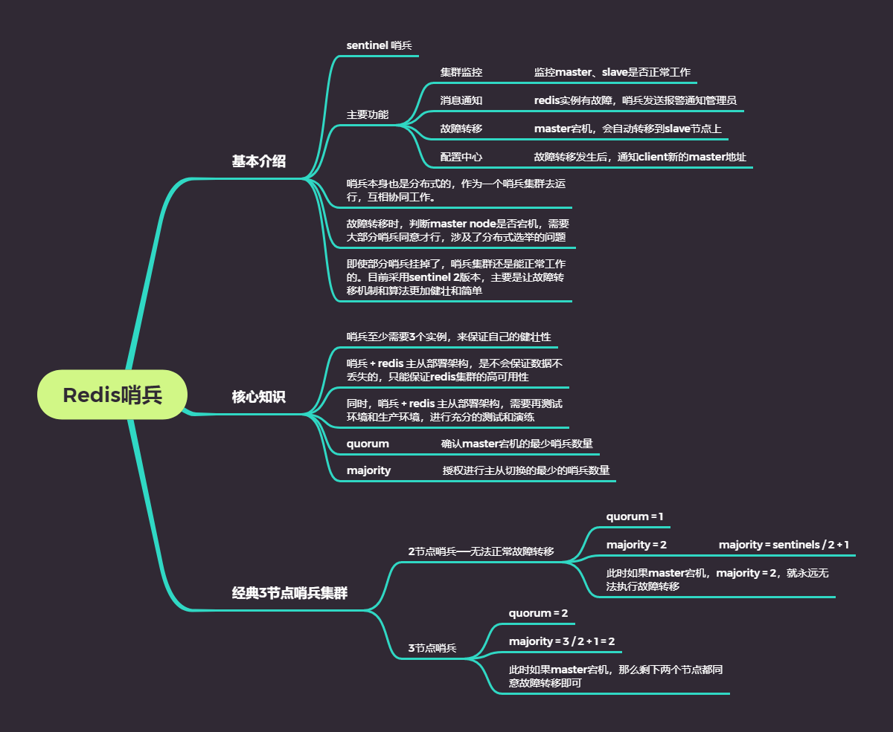
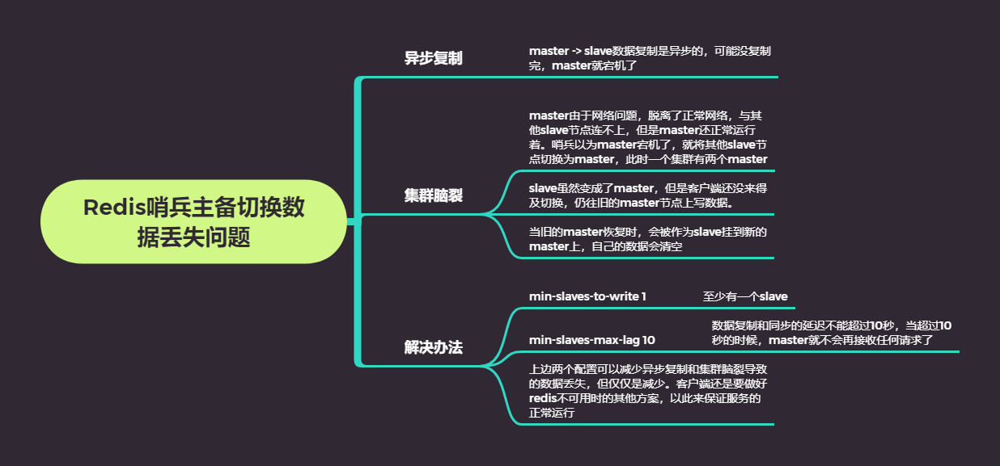
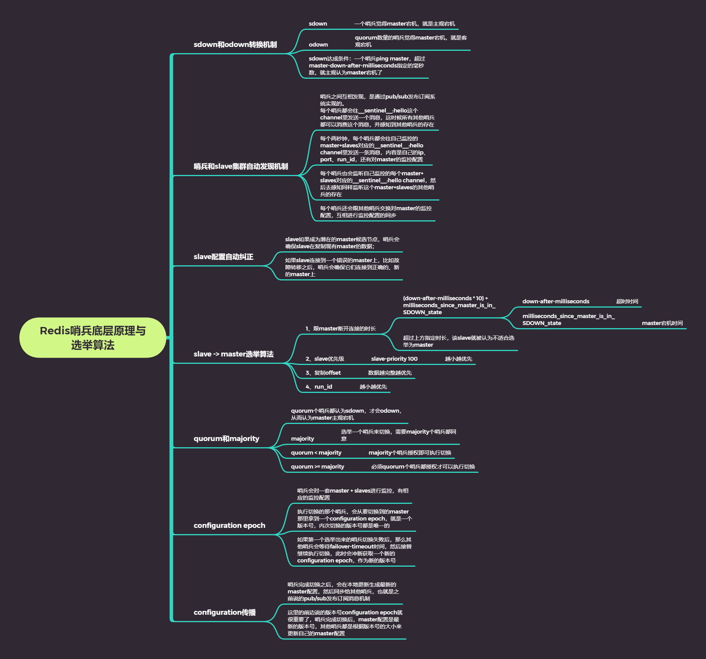
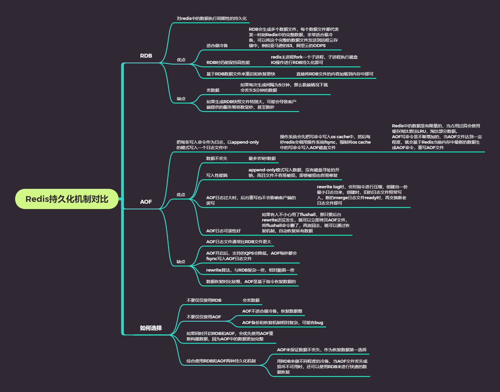
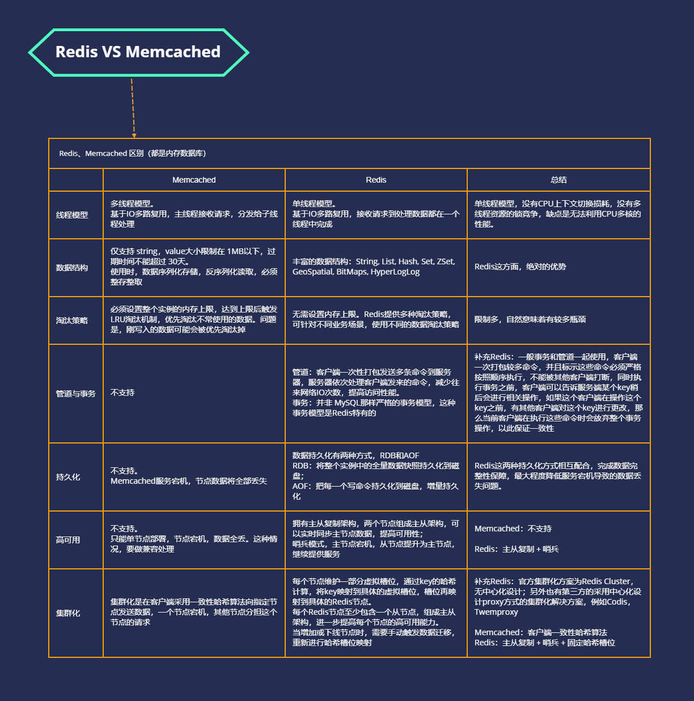

# 缓存 Cache

## 1、Redis单线程模型

## 2、Redis数据类型

## 3、Redis过期策略、淘汰策略、LRU简单实现

## 4、Redis主从复制

## 5、Redis主从复制深入剖析

## 6、Redis哨兵

## 7、Redis哨兵主备切换数据丢失问题

## 8、Redis哨兵底层原理与选举算法

## 9、Redis持久化机制对比

## n、Redis VS Memcached

