# 缓存 Cache

Cache Aside Pattern

（1）读的时候，先读缓存，缓存没有的话，那么就读数据库，然后取出数据放缓存

（2）更新的时候，先删除缓存，再更新数据库

## 1、Redis单线程模型

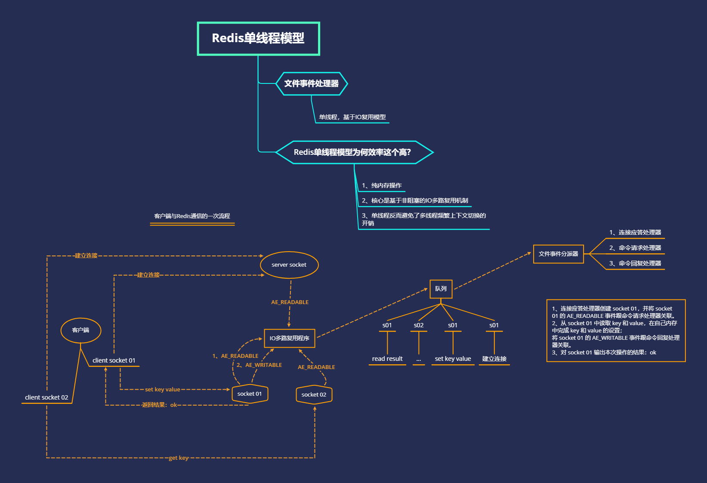

## 2、Redis数据类型

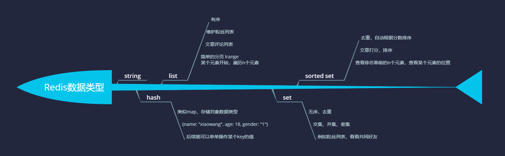

## 3、Redis过期策略、淘汰策略、LRU简单实现

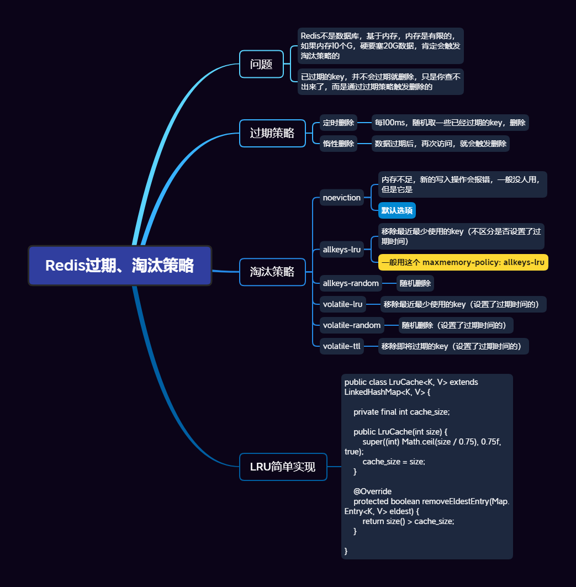

## 4、Redis主从复制

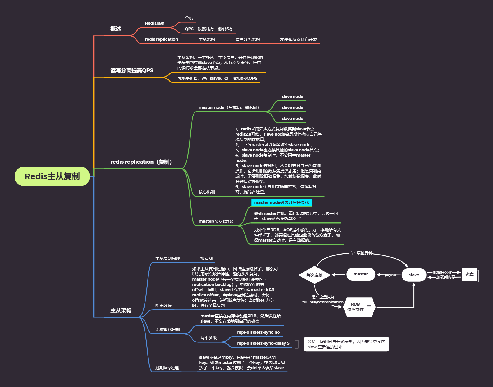

## 5、Redis主从复制深入剖析

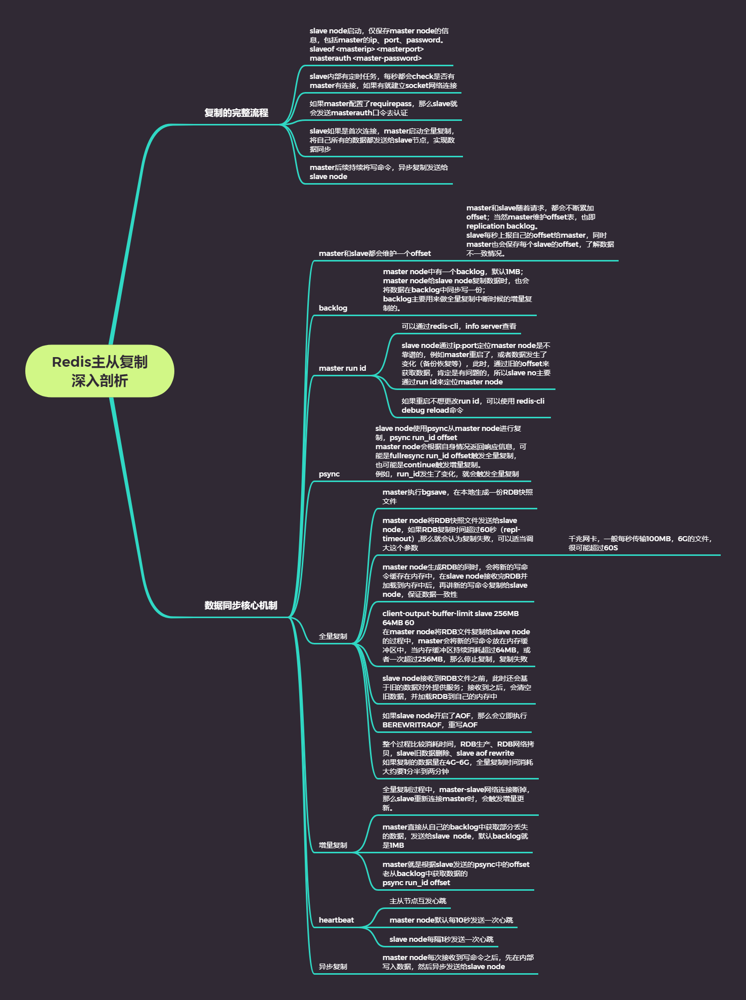

## 6、Redis哨兵

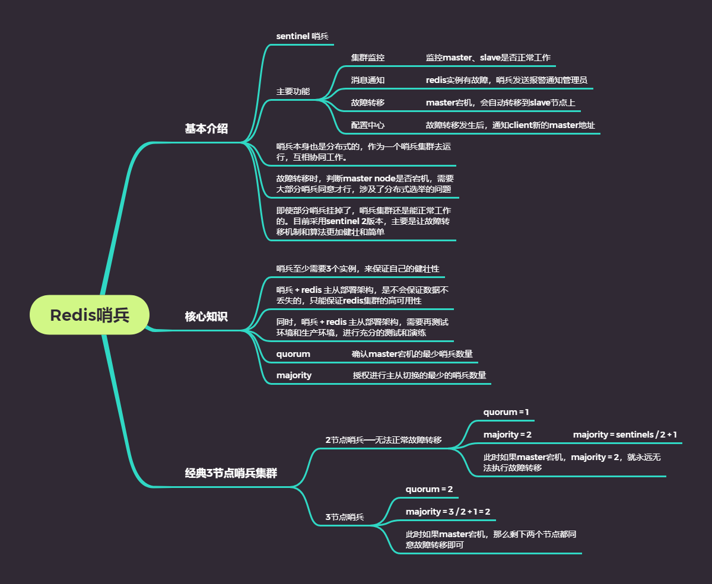

## 7、Redis哨兵主备切换数据丢失问题

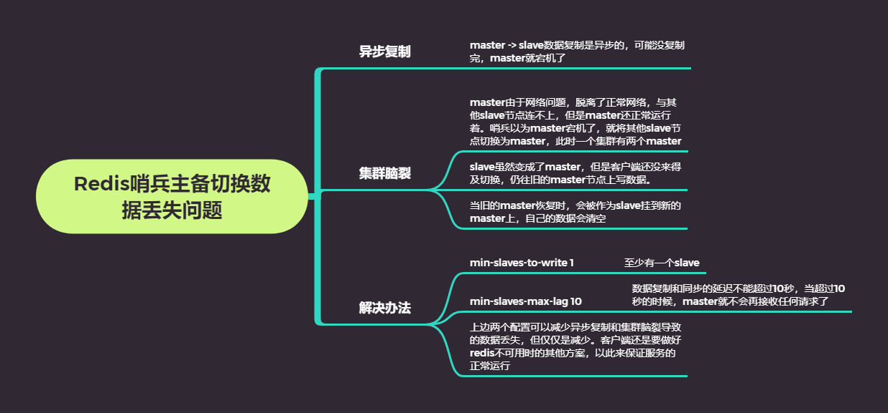

## 8、Redis哨兵底层原理与选举算法

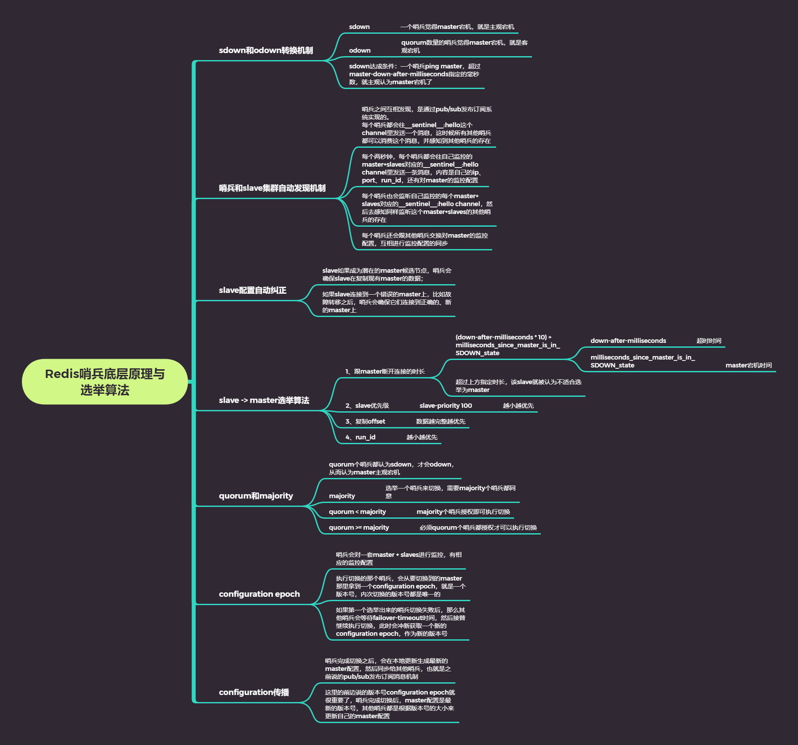

## 9、Redis持久化机制对比

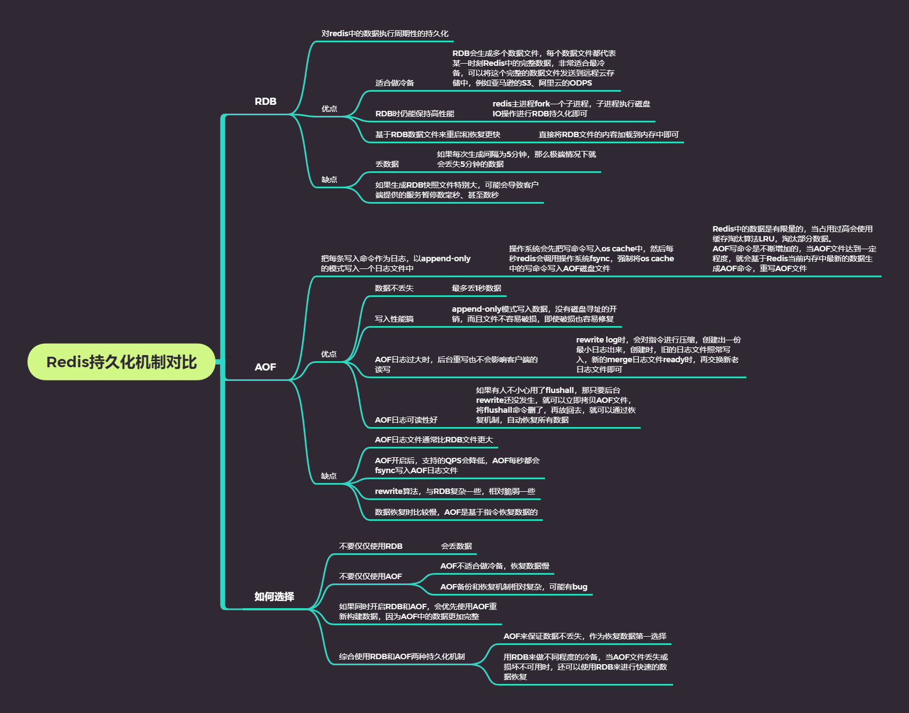

## 10、Redis集群模式

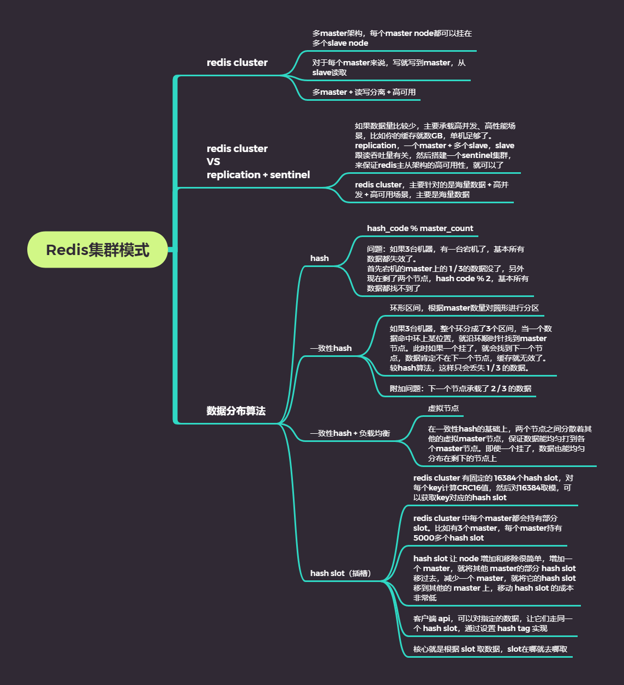

## 12、Redis缓存雪崩穿透击穿

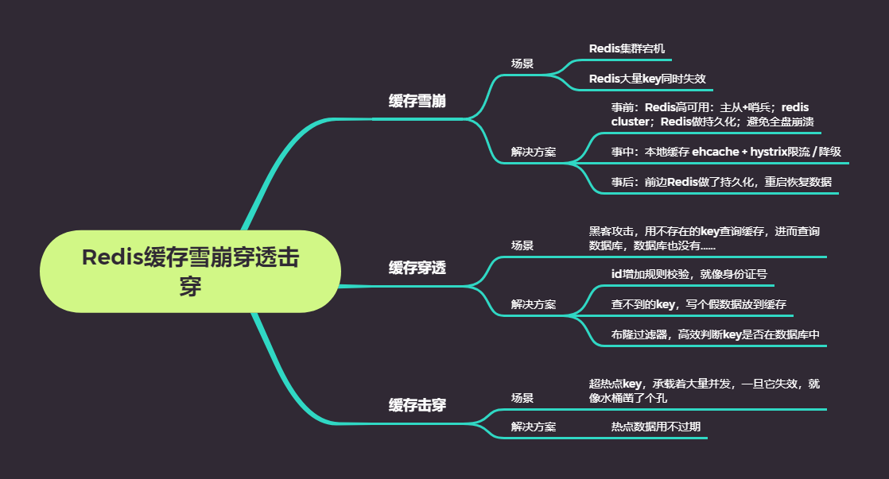

## n、Redis VS Memcached

