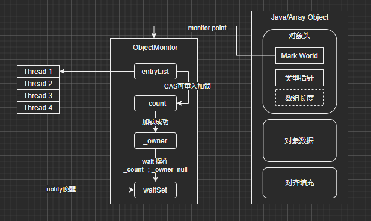

# Java 并发硬件层面

## 一、可见性涉及的底层硬件概念：寄存器、高速缓存、写缓冲器

- 寄存器
- 高速缓存
- 写缓冲器
- 无效队列

一个变量被处理器中运行的线程从主内存加载到高速缓存中，寄存器从高速缓存中获取数据并进行处理，处理完毕将数据写到写缓冲器，如果要保证可见性， 就会将写缓冲器中的数据写回 flush
高速缓存，或者主内存（不同的硬件实现可能有所差别），同时通过消息总线通知其他处理器，将他们高速缓存中的数据置为无效，如果其他线程需要访问数据，
就从修改数据的处理器的高速缓存中加载数据refresh，或者直接从主内存中加载数据refresh（不同的硬件实现可能有所差别）。

### 可见性问题：

1. 首先，可能存在寄存器级别，导致变量副本的更新，无法让其他处理器看到
2. 处理器运行的线程对变量的写操作都是针对写缓冲器来的，并不是直接更新主内存，所以很可能导致一个线程更新了变量，但是仅仅是在写缓冲器里，没有更新到主内存去；其他处理器的线程是没法读取它的写缓冲器的
3. 即使这个时候一个处理器的线程更新了写缓冲器之后，将更新同步到自己的高速缓存里（或者是主内存），然后还把这个更新通知给了其他的处理器，
   但是其他处理器可能就是把这个更新放到无效队列中去，没有更新它的高速缓存，其他处理器从高速缓存中读数据的时候，读到的还是过时的旧值。

### 解决办法：

通过MESI协议，注意，它仅仅是个协议，具体的实现机制要靠具体的底层系统实现。

### 核心概念

- flush：强制刷新数据到高速缓存（或主内存），不要仅仅停留在写缓冲器里面；

- 给消息总线bus发送消息，通知其他处理器，某个变量的值被它修改了；
- refresh：从总线嗅探到某个变量被修改了，必须强制从其他处理器的高速缓存（或主内存）中加载变量的最新值到自己的高速缓存中去；
- 内存屏障的使用，在底层硬件级别的原理，其实就是在执行flush和refresh。MESI协议与内存屏障搭配使用（flush、refresh）

### volatile

- 写volatile变量，就会通过执行一个内存屏障，在底层触发flush处理器缓存操作；读volatile变量，也会通过执行一个内存屏障，在底层触发refresh。
- 当然volatile的变化有可能写到高速缓存中，也有可能写到主内存中，看具体的硬件实现了。

## 二、三大问题（原子性、可见性、有序性）

#### 1. 原子性

Java底层保证赋值写操作是原子性的，复杂的不能保证

#### 2. 可见性

MESI协议，flush、refresh，配合起来，解决可见性问题

#### 3. 有序性

- 编译阶段，javac、JIT
- 现代处理器提升性能，指令乱序和猜测执行机制
- 高速缓存和写缓冲器内存重排序乱序（LoadLoad,StoreStore,LoadStore,StoreLoad）

### synchronized

> 同时保证原子性、可见性、有序性

1. 原子性：同一段代码只能一个执行。
2. 可见性：同步代码块，写操作释放锁时，强制flush；读操作时，强制refresh。
3. 有序性：通过各种内存屏障，来解决LoadLoad等等重排序。

```java
class Test {
    int a = 0;
    int b = 0;

    public void testLoadStore() {
        synchronized (this) { // monitor_enter
            // Load 内存屏障（refresh，从别的处理器高速缓存或主内存中加载最新值）
            // Acquire 内存屏障（禁止读操作和读写操作发生指令重排）

            int c = a;
            // Store 内存屏障（flush，将变量值刷新到高速缓存或主内存中）
            b = 1;

            // Release 内存屏障（禁止写操作和读写操作发生指令重排）
        } // monitor_exit
    }
}
```

1. 原子性
    - 类似AQS的加锁方案
    - 
2. 可见性
    - 如上代码注释，通过Load和Store内存屏障保证可见性
3. 有序性
    - 如上代码注释，通过Acquire和Release内存屏障保证有序性
    - 注意保证的是synchronized锁定的代码块内外代码的有序性，代码块内也有可能发生指令重排

### volatile

待续。。。