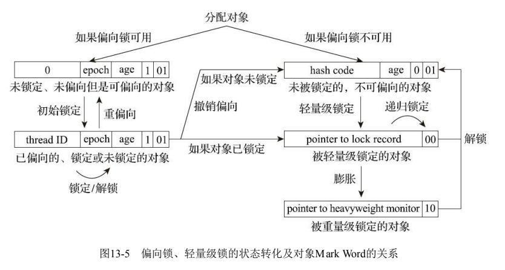

# Java虚拟机对锁的优化

> 锁消除、锁粗化、偏向锁、自旋锁



## 锁消除

锁消除是JIT编译器对synchronized锁做的优化，编译的时候，JIT会通过逃逸分析技术（在堆上的所有数据都不会逃逸出去被其他线程访问到），
来分析synchronized锁对象，是不是只可能被一个线程来加锁，没有竞争加锁情况，这个时候编译就不用加入monitorenter、monitorexit指令。

## 锁粗化

```java
class Test {
    public String concatString(String s1, String s2, String s3) {
        StringBuffer sb = new StringBuffer();
        sb.append(s1);
        sb.append(s2);
        sb.append(s3);
        return sb.toString();
    }
}
```

我们虽然知道，锁的粒度尽可能要小，但不可避免，我们有可能会遇到上边的情况，一串append，每个都有方法锁。

如果虚拟机探测到有这样一串零碎的操作都对同一个对象加锁，将会把加锁同步的范围扩展（粗化）到整个操作序列的外部，就是扩展到第一个append()操作之前直至最后一个append()操作之后，这样只需要加锁一次就可以了。

## 偏向锁


## 自旋锁

